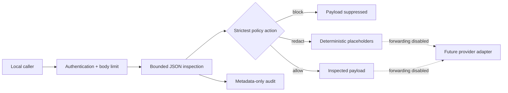

# AI Firewall

AI Firewall is a local-first, open-source research framework for inspecting structured information
before an application sends it to a cloud AI or large-language-model service. It applies a strict
local policy and returns an `allow`, `redact`, or `block` decision with metadata-safe findings.

> **Research boundary:** this is not a complete endpoint-security or data-loss-prevention product.
> It only protects requests deliberately integrated with its API. It has no claim of preventing
> every leak, no regulatory certification, and no production-ready provider forwarding path.

## Current capabilities

- Strict default-block YAML policy with validated rules and exact provider host metadata
- Pattern-based detection for credentials, private keys, payment-card formats, email addresses,
  Indian PAN formats, and sensitive field names
- Bounded JSON traversal with size, depth, node, malformed-value, and detector-failure gates
- Deterministic redaction without generative rewriting
- Authenticated scan and policy-summary APIs
- Metadata-only JSONL audit events without raw prompts, matches, or authorization headers
- HTTPS destination and caller-header validation contracts, while forwarding remains disabled
- Accessible local scan-review workspace with optional local-only history, report export, and a
  copyable qualified Markdown review brief
- Deterministic local frontend audit and automated security-boundary tests

## Quick start

```bash
python -m venv .venv
source .venv/bin/activate
pip install -e '.[dev]'
cp .env.example .env
```

Set `AI_FIREWALL_API_KEY` in `.env` to a synthetic local key of at least 32 characters, then run:

```bash
uvicorn ai_firewall.main:app --reload --host 127.0.0.1 --port 8080
```

Open `http://127.0.0.1:8080/` for the local review workspace. Use synthetic content only. The key
is held in page memory and is never saved to browser storage. Optional scan history stays in the
browser on that device and can be cleared from advanced settings.

Check process liveness and dependency-aware readiness:

```bash
curl http://127.0.0.1:8080/health
curl http://127.0.0.1:8080/ready
```

Scan a synthetic payload:

```bash
curl -s http://127.0.0.1:8080/v1/scan \
  -H 'content-type: application/json' \
  -H 'x-ai-firewall-api-key: SYNTHETIC_LOCAL_KEY_AT_LEAST_32_CHARS' \
  -d '{"payload":{"prompt":"Contact synthetic.user@example.com"}}'
```

`/health` exposes liveness only. `/ready` returns one generic unavailable response unless local
authentication is configured and the audit sink is usable. Interactive API documentation is
disabled.

## Request and trust flow



The policy default applies only when no rule matches. Explicit matching rules still decide whether
content is redacted or blocked. Detector failures and malformed or unsupported structures block.
The `/v1/proxy` route is unavailable by design until local credential injection, DNS connection
pinning, outbound serialization rescan, response bounds, and deployment egress controls are built
and validated.

## Validation

```bash
pytest
ruff check .
python -m compileall -q src tests scripts
python scripts/review_frontend.py
```

The frontend review is local, deterministic, and network-free. It checks source-level accessibility,
clarity, responsive, privacy, security, interaction, and maintainability signals. Manual browser,
assistive-technology, and security review are still required.

## Project documentation

- [Architecture](docs/architecture.md)
- [Security boundary](docs/security.md)
- [Known limitations](docs/limitations.md)
- [Validation protocol](docs/validation-protocol.md)
- [0.1.1 candidate readiness](docs/release-readiness.md)
- [Compliance boundary](docs/compliance.md)
- [Provenance](docs/provenance.md)
- [Governance](GOVERNANCE.md)
- [Contributing](CONTRIBUTING.md)
- [Security reporting](SECURITY.md)

## License and citation

Licensed under the [Apache License 2.0](LICENSE). Citation metadata is provided in
[`CITATION.cff`](CITATION.cff). See [`NOTICE`](NOTICE) for attribution information.
