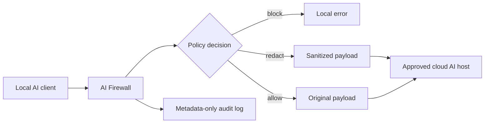

# AI Firewall

AI Firewall is a starter framework for preventing accidental sensitive-data leakage when local applications call cloud AI or LLM APIs. It runs as a local gateway, inspects outbound JSON payloads, and either allows, redacts, or blocks the request according to policy.

## What is included

- Pattern-based detection for credentials, payment cards, private keys, and common personal data
- Configurable `allow`, `redact`, and `block` actions
- A generic HTTP proxy endpoint with a destination allowlist
- A scan-only endpoint for integration into applications and browser/desktop agents
- An authenticated policy-summary endpoint for safe operator inspection
- Privacy-preserving JSONL audit events (no raw prompt or secret values)
- Tests and a Docker starter configuration

This is a foundation, not a complete endpoint-security product. Production deployments should add OS-level traffic enforcement, authentication, TLS interception only where legally appropriate, stronger secrets/entity classifiers, signed policy distribution, secure audit shipping, and an administrative console.

## Quick start

```bash
python -m venv .venv
source .venv/bin/activate
pip install -e '.[dev]'
cp .env.example .env
uvicorn ai_firewall.main:app --reload --host 127.0.0.1 --port 8080
```

Open `http://127.0.0.1:8080/` for the dependency-free local scan console. It keeps
the API key only in page memory and is for synthetic test content, not production
administration.

Check the service:

```bash
curl http://127.0.0.1:8080/health
curl http://127.0.0.1:8080/ready
```

`/health` is a liveness check. `/ready` returns a generic unavailable response unless local
authentication is configured and the metadata-only audit sink can be opened.

Scan content before an LLM call:

```bash
curl -s http://127.0.0.1:8080/v1/scan \
  -H 'content-type: application/json' \
  -H 'x-ai-firewall-api-key: YOUR_LOCAL_FIREWALL_KEY' \
  -d '{"payload":{"prompt":"Email me at alice@example.com"}}'
```

The proxy route is intentionally unavailable in this milestone. Caller authorization and transport
headers are discarded, but provider-specific local credential injection and DNS connection pinning
are not implemented yet. Configuration cannot enable forwarding until provider adapters complete
and test those boundaries.

## Request flow



Edit `config/policy.yaml` to change rules and approved destinations. See `docs/architecture.md` and `docs/security.md` for extension guidance.

The policy default applies only when no rule matches. Explicit matching rule actions still decide
whether a payload is redacted or blocked; detector failures block rather than allowing uninspected
content.
