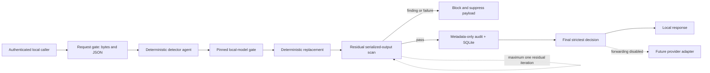

# Privacy enhancement plan

## Outcome and threat path

The intended outcome is a local enforcement layer that prevents sensitive source content from
being persisted or sent to cloud AI unless a validated policy explicitly permits a sanitized
representation. The primary threat path is attacker-controlled or accidentally sensitive content
moving from a local caller through parsing, detectors, model runtimes, logs, databases, event
streams, and finally an approved provider connection.

The current implementation completes the first local inspection slice. It does not yet force all
device traffic through the gateway and provider forwarding remains disabled.

## Implemented local privacy graph

Every graph phase emits an ordered real-time event. Event metadata is key-allowlisted and cannot
contain payloads, matched text, headers, paths, credentials, prompts, or model source text. The
browser receives these events through authenticated server-sent events.

## Agents, actions, events, models, and loops

| Agent | Current action | Failure action |
|---|---|---|
| Request gate | Authenticate, enforce Host and body limits, validate JSON schema | Reject |
| Deterministic detector | Inspect bounded JSON keys/values and create deterministic replacements | Block |
| Local-model gate | Verify configured artifact digest and structured span contract | Block |
| Residual guard | Serialize sanitized output and independently rescan it | Block |
| Decision agent | Select the strictest action | Block on ambiguity |
| Metadata writer | Write only decision, counts, rule/model IDs, timing, and policy version | Block |

Events cover received, deterministic detection, local-model detection, residual scan, decision,
metadata persistence, and completion. The only loop is one bounded residual rescan; it never retries
indefinitely. `/v1/privacy/topology` reports the actual runtime graph, model state, events, loop, and
storage/forwarding modes.

`config/models.yaml` is intentionally empty. No sample model, unverified weight, runtime download,
or remote inference endpoint is bundled. The model framework accepts only relative local artifacts,
SHA-256 pins, the ONNX runtime identifier, allowlisted entity types, confidence thresholds, and
deadlines. Implementations must be injected locally and return validated spans; free-form model
rewrites are never authoritative. A configured artifact, runtime, timeout, or span failure makes
readiness fail and blocks requests that require the model stage.

## Local storage contract

- Raw payload: memory only for the lifetime of a request
- Sanitized payload: returned transiently, never written by the backend
- Browser storage: not used
- SQLite: local metadata-only summaries, mode `0600`, parent directory mode `0700`, maximum 1,000
  rows, secure-delete enabled
- JSONL audit: local metadata only
- SSE: transient key-allowlisted metadata events plus the final local response
- Provider egress: disabled

SQLite is not application-level encrypted in the current slice because it stores no source or
sanitized content. Regulated deployments should still use full-disk encryption and managed device
controls. If reversible pseudonyms or source content are ever stored, they require a separate
encrypted, TTL-bound vault backed by an OS key store; they must never enter this metadata database.

## Enterprise roadmap

### Phase 2 — deterministic coverage

- Unicode normalization with an offset map, zero-width/confusable detection, entropy checks,
  bounded base64/URL/hex/JWT decoding, fragmentation views, and exact final-byte rescan
- Provider request adapters with strict content schemas and explicit supported fields
- Tamper-evident audit chaining, rotation, quotas, and disk-pressure gates
- Rate, concurrency, scan-time, string-length, and match-count budgets

Acceptance: synthetic bypass corpus and property tests demonstrate bounded work and no source value
in any persistent or telemetry sink.

### Phase 3 — validated local ML

- Select a non-generative token-classification model with an enterprise-compatible license
- Record immutable artifact digest, dataset/model cards, evaluation provenance, supported languages,
  subgroup error analysis, thresholds, and rollback
- Run in a network-denied worker with read-only weights, resource limits, no telemetry, no remote
  code, no startup downloads, and schema-only IPC
- Add deterministic typed replacement and independent residual scans

Acceptance: crash, timeout, malformed span, overlap, Unicode, prompt-injection, no-network, drift,
and residual-leak tests all fail closed. No model is approved merely because it is popular or new.

### Phase 4 — content and provider enforcement

- Sandboxed document, image/OCR, archive, and audio parsers with decompression/page/pixel/frame limits
- Local credential injection from OS keychain or enterprise secret manager
- Exact provider host/port/path policy, DNS resolution validation and connection pinning, no redirects,
  no environment proxy inheritance, bounded response inspection, and streaming frame reassembly
- OS/browser/MDM/VPN/EDR or network egress controls so applications cannot bypass the gateway

Acceptance: controlled SSRF, DNS rebinding, split-frame, parser-fault, and egress-bypass tests; an
independent deployment assessment; and a tested rollback.

### Phase 5 — regulated operations

- Workload identity and least-privilege authorization by provider, model, data class, and purpose
- Signed policy/model manifests, monotonic versions, last-known-good rollback, SBOM, hash-locked
  dependencies, digest-pinned images, vulnerability/secret scanning, and reproducible builds
- Retention, deletion, legal hold, incident response, access review, metrics, drift monitoring,
  change approval, and jurisdiction/provider contracts
- Independent privacy, security, legal, and framework-specific assessment

No phase creates automatic GDPR, HIPAA, PCI DSS, ISO 27001, SOC 2, FedRAMP, or other compliance.

## Model selection criteria for regulated industries

Candidate models must be locally runnable, non-generative for span extraction, license-compatible,
available as immutable artifacts, supported without remote code, and evaluable on an approved local
corpus. Selection evidence must include precision/recall by entity class, calibration, latency and
memory budgets, language/domain coverage, known bias, false-negative handling, and version rollback.
Cloud-hosted APIs, telemetry-enabled runtimes, mutable model tags, runtime downloads, and models
without dataset/license provenance are rejected.

## Acceptance matrix for this slice

- All scan API paths use the privacy orchestrator: implemented
- Real-time ordered phase events: implemented
- Runtime graph/model/loop/action discovery: implemented
- No browser payload persistence or runtime sample payload: implemented
- Local database contains metadata only: implemented and tested
- Model artifact/digest/span/timeout contracts: implemented; no model enabled
- Residual serialized-output scan: implemented for redacted JSON
- Persistence failure blocks and suppresses payload: implemented and tested
- Provider forwarding and device-wide enforcement: intentionally deferred and disabled
